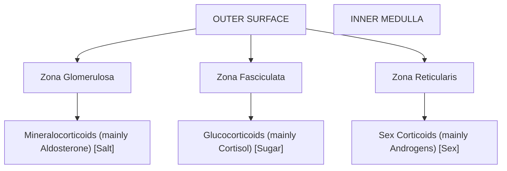

---
{"dg-publish":true,"permalink":"/docs/harmones/","tags":["flashcards"],"dg-note-properties":{"tags":["flashcards"]}}
---

## 1\. Introduction to the Endocrine System & Hormones

### Neural vs. Endocrine Communication

| Feature | Nervous System | Endocrine System |
| --- | --- | --- |
| Messenger | Electrical impulses | Hormones (Chemical messengers) |
| Pathway | Neurons/Nerves | Bloodstream |
| Speed of Action | Rapid/Instantaneous | Slower (requires circulation) |
| Duration | Brief | Long-lasting |

### Classification of Glands

Glands are categorized based on how they release their secretions:

-   **Endocrine Glands:** Known as "ductless glands." They lack tubes and release hormones directly into the bloodstream to reach distant target cells or tissues (e.g., the pituitary gland).
-   **Exocrine Glands:** These possess ducts or tubes to transport secretions (generally enzymes) to specific locations (e.g., sweat glands, salivary glands, digestive glands).
-   **Heterocrine (Mixed) Glands:** These perform both endocrine and exocrine functions. The **pancreas** is the primary example, acting as an exocrine gland for digestion and an endocrine gland for blood sugar regulation.

### General Properties of Hormones

Hormones are defined as non-nutrient chemicals that act as intercellular messengers. Their core properties include:

-   **Chemical Nature:** They are secreted in trace (minute) amounts.
-   **Size:** Generally small molecules with low molecular weight.
-   **Solubility:** Most are water-soluble, though some (like steroids) are fat-soluble.
-   **Physiological Action:** They are highly reactive substances. After performing their function, they are typically destroyed and cannot be reused by the body.
-   **Storage:** Most hormones cannot be stored in the body, with the notable exception of **Thyroxine**, which can be stored in the thyroid gland.
-   **Specificity:** They are non-antigenic and generally non-species specific (e.g., insulin from one species can function in another).
-   **Historical Context:** The term "hormone" was coined by Starling. **Secretin** was the first hormone discovered (by Bayliss and Starling).

* * *

## 2\. Classification & Molecular Mechanisms

Hormones are classified both by their chemical structure and by the way they interact with target cells.

### Chemical Classification

1.  **Peptide/Protein Hormones:** Composed of amino acid chains. Examples include Insulin, Glucagon, Pituitary hormones, and Hypothalamic hormones.
2.  **Steroid Hormones:** Derived from cholesterol. Examples include Cortisol, Aldosterone, and sex hormones (Testosterone, Estrogen, Progesterone).
3.  **Amino Acid Derivatives:** Derived from single amino acids like Tyrosine. Examples include Epinephrine (Adrenaline), Norepinephrine, and Thyroid hormones (T3, T4).

### Mechanisms of Action: Group I vs. Group II

#### Group I: Lipophilic Hormones

These hormones (steroids, T3, T4) are lipid-soluble and can easily cross the cell membrane.

-   **Receptors:** Located intracellularly (in the cytosol or nucleus).
-   **Mechanism:** The hormone binds to its receptor to form a **Hormone-Receptor Complex**. This complex enters the nucleus and binds to a specific segment of DNA called the **Hormone Responsive Element (HRE)**. This interaction stimulates gene expression, leading to the synthesis of specific mRNA and subsequent protein production to carry out the hormone's function.

#### Group II: Hydrophilic Hormones

These hormones (peptides, catecholamines) are water-soluble and cannot cross the lipid bilayer of the cell membrane.

-   **Receptors:** Located on the cell surface.
-   **Mechanism:** The hormone acts as a **primary messenger**, binding to the surface receptor and triggering the generation of a **second messenger** inside the cell.
-   **Second Messenger Cascades:**
    -   **cAMP (Cyclic AMP):** Used by ACTH, FSH, LH, Glucagon, and PTH. ATP is converted to cAMP by the enzyme _Adenylate Cyclase_. cAMP is later broken down by _Phosphodiesterase_.
    -   **IP3/DAG and Calcium:** Used by TRH and Gastrin.
    -   **Unknown:** The second messengers for Growth Hormone and Insulin are currently not fully characterized.

### Hormonal Interactions

-   **Synergistic Effect:** Two or more hormones work together to produce a similar effect (e.g., Insulin and Growth Hormone both promote body growth).
-   **Antagonistic Effect:** Two hormones produce opposite effects to maintain homeostasis.
    -   **Insulin (lowers sugar) vs. Glucagon (raises sugar).**
    -   **PTH (raises calcium) vs. Calcitonin (lowers calcium).**

* * *

## 3\. The Central Command: Hypothalamus & Pituitary Gland

### The Hypothalamus

Acting as the master coordinator of hormonal action, the hypothalamus is part of the forebrain. It contains **Neurosecretory Cells (Nuclei)** that produce hormones to regulate the pituitary gland.

-   **Releasing Hormones:** Stimulate pituitary secretions (e.g.,  TRH, GHRH, GnRH).
-   **Inhibiting Hormones:** Stop pituitary secretions (e.g., Somatostatin inhibits Growth Hormone; Prolactin Inhibiting Hormone).

The **hypothalamus** is a crucial region of the brain that serves as the master coordinator of hormonal action, acting as the primary link between the nervous system and the endocrine system . Located at the base of the brain (specifically the forebrain) just above the pituitary gland, it directs the physiological activities of the body by controlling the pituitary gland, which is why the hypothalamus is often considered the "master of the master gland" 

#### Anatomical and Functional Connections
The hypothalamus regulates the pituitary gland through two distinct pathways:
*   **The Anterior Pituitary Connection:** The hypothalamus controls the anterior pituitary (adenohypophysis) through a specialized network of blood vessels known as the **hypothalamic-hypophyseal portal system**. The hypothalamus secretes releasing and inhibiting hormones directly into this portal system, delivering a concentrated dose of chemical signals straight to the anterior pituitary without diluting them in the general bloodstream 
*   **The Posterior Pituitary Connection:** The posterior pituitary (neurohypophysis) is actually an extension of the hypothalamus Specialized neurosecretory cells (called nuclei) located in the **supraoptic and paraventricular nuclei** of the hypothalamus synthesize hormones . These hormones are transported down the nerve axons through the pituitary stalk (infundibulum) and are stored in the nerve terminals of the posterior pituitary until a signal triggers their release 

#### Hormones of the Hypothalamus
The neurosecretory cells of the hypothalamus produce two main categories of regulatory hormones for the anterior pituitary: **Releasing Hormones** (which stimulate secretion) and **Inhibiting Hormones** (which suppress secretion) . It also synthesizes two hormones that are stored in the posterior pituitary.

**1. Releasing Hormones (Stimulatory)**
*   **Thyrotropin-Releasing Hormone (TRH):** Travels to the anterior pituitary to stimulate the synthesis and release of Thyroid-Stimulating Hormone (TSH), which subsequently regulates the thyroid gland 
*   **Corticotropin-Releasing Hormone (CRH):** Stimulates the anterior pituitary to release Adrenocorticotropic Hormone (ACTH) . ACTH then acts on the adrenal cortex to produce stress hormones like cortisol .
*   **Gonadotropin-Releasing Hormone (GnRH):** Stimulates the release of gonadotropins, specifically Follicle-Stimulating Hormone (FSH) and Luteinizing Hormone (LH), which regulate the testes and ovaries . Interestingly, GnRH must be secreted in short bursts or pulses (every 60 to 90 minutes) for normal function; continuous exposure to GnRH will paradoxically shut down the reproductive axis 
*   **Growth Hormone-Releasing Hormone (GHRH):** Promotes the production and release of Growth Hormone (GH) from the anterior pituitary, which regulates physical growth and metabolism .

**2. Inhibiting Hormones (Suppressive)**
*   **Somatostatin (Growth Hormone-Inhibiting Hormone):** Acts in opposition to GHRH by inhibiting the release of Growth Hormone . It also inhibits insulin and glucagon in the pancreas .
*   **Dopamine (Prolactin-Inhibiting Hormone / PIH):** Uniquely, the hormone Prolactin (which triggers milk production) is kept under constant, tonic inhibition by the hypothalamus via the release of dopamine . If this dopamine connection is blocked or severed, prolactin levels will automatically rise .

**3. Hormones Synthesized for the Posterior Pituitary**
While these two hormones are released into the body by the posterior pituitary, they are actually **synthesized entirely in the hypothalamus**:
*   **Anti-Diuretic Hormone (ADH / Vasopressin):**.
*   **Oxytocin:**

### The Pituitary Gland (Hypophysis)

#### Anatomy
- **Location**: It sits at the base of the brain, directly below the **hypothalamus**. It is housed inside a bony cavity or depression called the **Sella Turcica** , which is located within the **sphenoid bone** of the skull.
- **The Infundibulum**: The pituitary gland is physically joined to the hypothalamus by a narrow, tube-like stalk called the **infundibulum**.
- **The Master Gland**: Historically called the **"Master Gland"**, it regulates and coordinates the physiological activity of several other endocrine organs. However, the pituitary is itself regulated by the hypothalamus, making the hypothalamus the "master of the master gland".

#### Control Mechanisms:
- The hypothalamus secretes **releasing hormones** (which stimulate pituitary secretions) and **inhibiting hormones** (which stop pituitary secretions).
- For the **Anterior Pituitary**, these hypothalamic hormones travel through a specialized capillary network known as the **Hypophyseal Portal System**
- For the **Posterior Pituitary**, there is a direct neural connection. Specialized neurosecretory cells in the hypothalamus synthesize hormones and transport them down their axons (through the infundibulum) directly into the posterior lobe.

#### Parts of pituitary gland
The pituitary gland is anatomically and functionally divided into three distinct lobes: the **Anterior Pituitary**, **Pars Intermedia**, and the **Posterior Pituitary**

##### 1\. Anterior Pituitary / Adenohypophysis (Pars Distalis)
The anterior lobe is a true gland that synthesizes and secretes its own hormones upon receiving signals from the hypothalamus:
?
- **Growth Hormone (GH) / Somatotropin**:
    - **Function**: Regulates physical body growth, cell division, bone and muscle growth, protein synthesis, and general metabolism.
    - **Clinical Pathologies**:
        - **Hypersecretion (Excess GH)**: Excessive release during childhood leads to **Gigantism** . In **adults**, it causes **Acromegaly**, characterized by severe physical disfigurement, especially of the face, hands, and feet.
        - **Hyposecretion (Deficiency of GH)**: A lack of GH during **childhood** results in stunted growth, leading to **Pituitary Dwarfism** 
- **Thyroid Stimulating Hormone (TSH) / Thyrotropin**:
    - **Function**: TSH stimulates the thyroid gland to synthesize and release thyroid hormones (T3 and T4), which are responsible for regulating the body's Basal Metabolic Rate (BMR).
- **Adrenocorticotropic Hormone (ACTH) / Corticotropin**:
    - **Function**: Acts on the **Adrenal Cortex** (the outer layer of the adrenal gland situated on top of the kidneys). It stimulates the cortex to produce and release steroid hormones, particularly glucocorticoids like **Cortisol**, which is crucial for managing stress, trauma, and energy metabolism.
- **Prolactin (PRL)**:
    - **Function**: Governs the development and growth of mammary glands in females and directly stimulates **milk production** (milk synthesis).
    - _(Note: Prolactin is for milk production, while Oxytocin is required for milk ejection__)._
- **Follicle Stimulating Hormone (FSH)**:
    - **Function (Females)**: Promotes the growth, development, and maturation of ovarian follicles.
    - **Function (Males)**: Acts in conjunction with androgens to regulate **spermatogenesis** (sperm cell production).
- **Luteinizing Hormone (LH)**:
    - **Function (Females)**: Induces **ovulation** (the release of a mature egg from the Graafian follicle, typically on the 14th day of the menstrual cycle) and maintains the remaining follicle structure as the **Corpus Luteum**, which secretes progesterone to sustain pregnancy.
    - **Function (Males)**: Stimulates the **Leydig cells** (interstitial cells) of the testes to produce **Androgens / Testosterone**, which govern male sexual development and behaviors.

##### 2\. Middle Pituitary / Pars Intermedia
In humans, the Pars Intermedia is functionally fused with the Pars Distalis of the anterior lobe. It produces a single hormone:
?
- **Melanocyte Stimulating Hormone (MSH)**:
    - **Function**: MSH acts on **Melanocytes** (melanin-containing skin cells) to stimulate the production of the dark pigment **Melanin**. Melanin is the primary pigment responsible for regulating skin coloration and providing photoprotection.
    - _(Note: Melanin is a skin pigment__, which is distinct from Melatonin, a sleep-wake regulating hormone produced by the Pineal Gland__)._

##### 3\. Posterior Pituitary / Neurohypophysis (Pars Nervosa)
Unlike the anterior lobe, the posterior pituitary **does not synthesize any hormones of its own**. It serves as a **storage and release site** for two hormones produced by the neurosecretory cells of the **Hypothalamus**:
?
- **Oxytocin (The Birth / Love Hormone)**:
    - **Function (Childbirth)**: Stimulates powerful, coordinated contractions of uterine smooth muscle during labor to facilitate child delivery. For this reason, it is referred to as the **"Birth Hormone"**.
    - **Function (Lactation)**: Triggers the contraction of cells around the mammary glands to facilitate **milk ejection** (milk letdown) after birth.
    - **Function (Social Bonding)**: Nicknamed the **"Love Hormone"** because it plays a primary role in maternal-infant bonding, social recognition, and male-female intimacy.
- **Vasopressin / Anti-Diuretic Hormone (ADH)**:
    - **Function**: Maintains the body's water and electrolyte balance by promoting the **reabsorption of water** from the Distal Convoluted Tubules (DCT) and Collecting Ducts of the kidney's nephrons back into the bloodstream. It directly reduces the volume of water lost through urine.
    - **Clinical Pathologies**:
        - **Diabetes Insipidus**: A deficiency of ADH or Vasopressin results in **Diabetes Insipidus**. Because the kidneys cannot reabsorb water without ADH, the patient experiences excessive urination (polyuria), massive water loss, severe dehydration, and intense thirst. This is entirely separate from _Diabetes Mellitus_, which is associated with insulin deficiency and high blood glucose.

## 4\. Major Peripheral Endocrine Glands

### Thyroid Gland

The **thyroid gland** is the largest endocrine gland in the human body, known for its distinctive butterfly shape . It plays a critical role in regulating the body's metabolism and calcium homeostasis 

#### Anatomical and Microscopic Structure
*   **Location:** The thyroid gland is situated in the neck, wrapped around both sides of the trachea (windpipe) and just below the larynx (sound box) . Anatomically, it spans the level of the 5th, 6th, and 7th cervical vertebrae down to the 1st thoracic vertebra.
*   **Lobes and Isthmus:** It is a bilobed structure, consisting of a right and a left lobe . These two lobes are physically connected in the center by a narrow band of connective tissue known as the **isthmus** .
*   **Thyroid Follicles:** Microscopically, the gland is composed of numerous spherical structures called follicles, which are lined by cuboidal epithelium .These follicles secrete and surround a protein-rich material called **colloid**, which serves as the site for thyroid hormone synthesis . Uniquely among endocrine glands, the thyroid can store its hormones (within this colloid) for later use [7].
*   **Parafollicular Cells (C-cells):** Interspersed between the thyroid follicles are specialized cells called parafollicular cells or C-cells, which are responsible for secreting a separate hormone involved in calcium regulation .

#### Hormones of the Thyroid Gland
The thyroid gland secretes three primary hormones: two metabolic hormones from the follicles and one calcium-regulating hormone from the C-cells. The synthesis of the metabolic hormones heavily relies on the essential dietary element **iodine** and a protein called **thyroglobulin** 

**1. Tetraiodothyronine (T4) / Thyroxine**
*   **Structure & Abundance:** T4 contains four iodine atoms and is the most abundantly produced hormone by the thyroid gland 
*   **Function:** It acts as a reservoir in the blood and is essential for physical development, body growth, and maintaining the Basal Metabolic Rate (BMR) 

**2. Triiodothyronine (T3)**
*   **Structure & Potency:** T3 contains three iodine atoms .While it is secreted in much smaller quantities than T4, it is significantly more potent and biologically active . In peripheral tissues, such as the liver and kidneys, T4 is often converted into the highly active T3 .
*   **Function:** T3 and T4 work together to heavily regulate the body's carbohydrate, protein, and lipid metabolism .They also control body temperature, menstrual cycles, mood stability, and the health of skin and hair .

**3. Calcitonin (Thyrocalcitonin)**
*   **Function:** Secreted by the C-cells, calcitonin is a hypocalcemic hormone, meaning it works to **decrease blood calcium levels** when they become too high .
*   **Mechanism:** It achieves this by promoting the storage and deposition of calcium directly into the bones and by inhibiting the reabsorption of calcium in the renal tubules of the kidneys . Calcitonin acts antagonistically (in opposition) to the Parathyroid Hormone (PTH), which raises blood calcium .

#### Regulatory Control
The thyroid gland does not act independently; it is regulated by the central command axis:
*   The hypothalamus secretes **Thyrotropin-Releasing Hormone (TRH)** 
*   TRH travels to the anterior pituitary, stimulating the release of **Thyroid-Stimulating Hormone (TSH)** 
*   TSH binds to the thyroid gland, stimulating it to synthesize and release T3 and T4 into the bloodstream . This system operates on a negative feedback loop; when T3 and T4 levels are sufficiently high, they inhibit further release of TRH and TSH .

#### Clinical Pathologies of the Thyroid
Imbalances in thyroid hormone production lead to widespread systemic issues:

*   **Hyperthyroidism (Overactive Thyroid):** An excessive secretion of T3 and T4 rapidly accelerates the body's metabolic rate .
    *   **Symptoms:** Rapid weight loss despite a good appetite, heat intolerance, sweating, diarrhea, and high anxiety or mental excitability .
    *   **Grave's Disease:** A common autoimmune condition where antibodies continuously stimulate the thyroid to overproduce hormones without stopping .
*   **Hypothyroidism (Underactive Thyroid):** A deficiency in T3 and T4 production slows down the metabolic rate .
    *   **Symptoms:** Unexplained weight gain, severe fatigue, cold intolerance, dry skin, and constipation .
    *   **Goiter:** Swelling or enlargement of the thyroid gland, often caused by iodine deficiency 
    *   **Cretinism:** A severe condition in children caused by a lack of thyroid hormone during development, leading to stunted physical growth and mental retardation 
    *   **Myxedema:** A condition in adults characterized by severe hypothyroidism, leading to fluid retention and distinct puffiness around the face and eyes 

### Parathyroid Gland

#### Anatomy and Location of the Parathyroid Glands

- **Structure and Count:** There are **four small, yellow-colored** parathyroid glands in the human body.
- **Location:** They are located on the **posterior (back) surface of the thyroid gland**, with two glands situated on each of the thyroid's lobes. Due to their small size, they are easily overlooked but are highly vascularized and crucial for survival.

#### Parathyroid Hormone (PTH) / Parathormone

- **Primary Secretion:** The parathyroid glands synthesize and secrete **Parathyroid Hormone (PTH)**, also known as **parathormone**.
- **Primary Function:** PTH is the **primary regulator of blood calcium (\(Ca^{2+}\)) levels**. It acts as a **hypercalcemic hormone**, meaning its main physiological role is to **raise calcium levels** in the bloodstream whenever they drop below normal (hypocalcemia).
- **Cellular Mechanism:** PTH is a Group II hydrophilic hormone. It binds to G-protein coupled receptors (GPCRs) on the surface of its target cells, utilizing **cyclic AMP (cAMP)** as its secondary messenger to trigger rapid enzyme cascades.

#### Triple Action Mechanism to Raise Blood Calcium

To restore calcium homeostasis when blood calcium drops, PTH acts on three primary target sites:

1. **Bone (Bone Resorption):**
    
    - PTH directly acts on bone tissue. It stimulates **osteoclasts** (cells that break down bone tissue) to perform **bone resorption, dissolution, or demineralization**.
    - This breaks down the hard bone matrix, releasing stored calcium and phosphate directly into the bloodstream.
2. **Kidneys (Renal Reabsorption & Vitamin D Activation):**
    
    - PTH acts on the renal tubules of the kidneys to **increase the reabsorption of calcium** from urine back into the blood.
    - Simultaneously, it **decreases phosphate reabsorption**, prompting excess phosphate to be excreted through urine.
    - Additionally, PTH activates **Vitamin D** in the kidneys by stimulating the enzyme **1-alpha-hydroxylase**, which converts inactive Vitamin D into its biologically active form, **calcitriol**.
3. **Small Intestine (Indirect Dietary Absorption):**
    
    - The newly synthesized active Vitamin D (calcitriol) travels to the digestive tract.
    - Calcitriol acts on the small intestine to **significantly increase the absorption of calcium** from the dietary food you eat.

#### Feedback Control and Antagonism with Calcitonin

- **Negative Feedback Loop:** Once blood calcium levels return to normal, the parathyroid glands sense the rise and suppress further PTH secretion, keeping the system stable.
- **Antagonistic Action:** PTH works in direct opposition (**antagonism**) to **Calcitonin** (Thyrocalcitonin or TCT), which is produced by the parafollicular C-cells of the thyroid gland. While PTH acts to raise blood calcium, Calcitonin acts to lower blood calcium when it is too high. Together, these two hormones maintain the body's precise calcium balance.

#### Clinical Pathologies

- **Hyperparathyroidism (Excess PTH):**
    - Too much PTH causes excessive calcium to be pulled into the blood (hypercalcemia).
    - **Symptoms:** This leads to **kidney stones** (from filtered calcium), **bone pain** (due to bone thinning/resorption), **abdominal pain**, and **psychiatric symptoms**.
- **Hypoparathyroidism (Deficient PTH):**
    - A deficiency of PTH causes dangerously low blood calcium levels (hypocalcemia).
    - **Symptoms:** This causes extreme neuromuscular irritability, resulting in **tetany** (painful muscle spasms and cramps). Clinicians can identify this neuromuscular irritability using fdiagnostic tests such as **Chvostek's sign** or **Trousseau's sign**.

---

### Pineal Gland

#### Anatomy, Location, and Nickname

- **Structure and Size:** The **pineal gland**  is an extremely small, pinecone-shaped endocrine gland.
- **Location:** It is located deep within the brain, situated on the **dorsal side of the forebrain** , specifically in a region called the **epithalamus**.
- **The "Third Eye" :** Because of its deep-seated position in the center of the brain and its unique relationship with light sensitivity, the pineal gland is historically and clinically referred to as the **"Third Eye"**.

---

#### Melatonin: Chemistry and Receptor Mechanism

The pineal gland secretes a single principal hormone called **Melatonin**:

- **Chemical Classification:** Melatonin belongs to the **amino acid derivative** class of hormones, synthesized specifically from the essential amino acid **tryptophan**.
- **Melatonin vs. Melanin:** There is a critical distinction between these two similarly named biological substances:
    - **Melatonin** is the **regulatory hormone** produced by the pineal gland.
    - **Melanin** is a **skin pigment** produced by melanocytes that determines physical skin coloration and provides photoprotection.
- **Mechanism of Action:** Because of its biochemical properties, melatonin is unique in its signaling; it can act on **both cell surface receptors and intracellular receptors** to regulate physiological functions.

---

#### The Regulation of Melatonin Secretion (The Light-Dark Axis)

Melatonin secretion is highly dynamic and is strictly **controlled by environmental light exposure**. It operates on a precise neural pathway:

1. **Daytime (Light Phase):**
    - Light entering the eyes stimulates the retina, which sends electrical signals through a specialized nerve tract called the **retinohypothalamic tract**.
    - These signals reach the **suprachiasmatic nucleus (SCN)** in the hypothalamus (the master circadian pacemaker).
    - The SCN sends down regulatory signals that **suppress melatonin production**, keeping daytime levels at their lowest.
2. **Nighttime (Dark Phase):**
    - When environmental darkness is detected, the inhibitory signals from the SCN are lifted.
    - Melatonin production is rapidly upregulated, causing a sharp **rise in circulating melatonin levels**, which signals the body that it is time to sleep.

---

#### Physiological Functions of Melatonin

Melatonin is much more than just a sleep promoter; it has widespread biological effects:

- **Circadian Rhythm Regulation (24-Hour Diurnal Rhythm):** Melatonin is the primary regulator of the body's **24-hour internal biological clock**. It dictates the daily routines of metabolism, alertness, and cellular recovery.
- **Sleep-Wake Cycle (स्लीप वेक साइकिल):** It establishes and maintains natural sleep patterns. High levels of nighttime melatonin lower alertness to promote deep, restorative sleep.
- **Body Temperature Regulation:** Melatonin directly helps coordinate and **maintain basal body temperature** in synchronization with the sleep-wake cycle.
- **Pigmentation:** Melatonin exerts secondary regulatory actions on **skin pigmentation**.
- **Menstrual Cycle & Reproductive Functions:** It influences the timing and regulation of the **menstrual cycle** in females.
- **Immune Defense Capabilities:** Melatonin also modulates and **regulates the body's defense and immune capabilities**.

---

#### Clinical Considerations and Modern Disruptions

- **The "Screen Light" Phenomenon:** In the modern era, late-night usage of mobile phones, tablets, or televisions exposes the eyes to artificial blue light. The brain misinterprets this artificial brightness as daylight, causing the SCN to **re-suppress melatonin secretion**. This directly leads to sleep onset delay, insomnia, and circadian misalignment.
- **Therapeutic Applications:** Exogenous melatonin supplements are clinically used to manage **jet lag** and **shift work sleep disorders**, helping realign the body's internal clock when it is out of sync with the external environment.

---

### Thymus Gland

#### Anatomy and Location of the Thymus Gland

- **Structure:** The **thymus gland**  is a specialized, lobular lymphoid organ that also functions as an essential endocrine gland.
- **Location:** It is situated in the upper thoracic (chest) cavity. Specifically, it is located:
    - **Between the two lungs**
    - **Behind the sternum** / breastbone 
    - On the **ventral side of the aorta** 

---

#### The Thymic Hormone: Thymosin 

The thymus gland synthesizes and secretes a group of peptide hormones collectively known as **Thymosins**.

- **Chemical Classification:** It is a **peptide hormone**.
- **Primary Function:** Thymosins play an indispensable, dual role in establishing and maintaining the body's immune defense capabilities.

---

#### Double-Action Immunological Mechanisms

Thymosins are responsible for training the body's defenses through two major pathways:

1. **Cell-Mediated Immunity 
    - Immature T-cells are produced in the bone marrow but travel to the thymus gland for further development.
    - Thymosins actively promote the **differentiation and maturation of T-lymphocytes (T-cells)**.
    - These mature T-cells are critical for identifying and destroying virus-infected cells and foreign pathogens.
2. **Humoral / Antibody-Mediated Immunity 
    - Thymosins also stimulate humoral immunity by **promoting the production of antibodies** by plasma cells.
    - These antibodies circulate in bodily fluids to target and neutralize extracellular pathogens.

---

#### Age-Related Atrophy 

The thymus gland undergoes highly distinct, age-dependent structural and functional changes:

- **In Newborns / Infants:** The thymus is **not fully developed at birth**, which is a primary reason why infants have a weaker, developing immune system.
- **During Puberty:** It reaches its peak size and maximum hormone-producing activity.
- **In Old Age (वृद्धावस्था):** As age increases, the thymus gland undergoes progressive **degeneration or atrophy**. The functional thymic tissue is gradually replaced by fatty and fibrous tissue.
- **Clinical Consequence:** Because of this atrophy, **Thymosin levels decline sharply in elderly individuals**. Consequently, their immune system and cellular defenses weaken significantly, making them much more vulnerable to infections and diseases.

---

### Adrenal Glands

#### Anatomy and Structure of the Adrenal Gland

- **Location:** The **adrenal glands** (also known as **suprarenal glands**  are paired endocrine organs that sit like caps directly on the top (anterior/superior pole) of each kidney.
- **Asymmetry & Dimensions:** The two glands exhibit distinct anatomical shapes; the **right adrenal gland is triangular** in shape, whereas the **left adrenal gland is crescent-shaped**. Each gland is approximately 4 cm in length and weighs about 4 grams.
- **Dual-Tissue Structure:** Under the microscope, the adrenal gland is composed of two completely distinct types of tissue, representing two glands fused into one:
    1. **Adrenal Cortex :** The outer glandular layer, which constitutes **75% to 80%** of the total gland volume. It is responsible for producing **steroid** hormones.
    2. **Adrenal Medulla :** The inner core layer, making up the remaining **20% to 25%** of the gland. It is modified neuroectodermal tissue that functions as part of the **sympathetic nervous system**.
- **The "4S Gland" Nickname:** 
    1. **S**ugar Metabolism (administered by Cortisol)
    2. **S**alt Retention (administered by Aldosterone)
    3. **S**ex Hormones (administered by Adrenal Androgens)
    4. **S**tress Reactions (administered by Catecholamines)

---

#### 1. The Adrenal Cortex (GFR Layers: Salt, Sugar, Sex)

three concentric zones
acronym **GFR** (from outer to inner)

#### A. Zona Glomerulosa (Outermost Layer) — Mineralocorticoids ("Salt")

- **Primary Hormone:** **Aldosterone** .
- **Physiological Classification:** Aldosterone is classified as a **"Life-Saving Hormone"**  because its absolute absence causes rapid electrolyte imbalances that can lead to immediate death.
- **Mechanism and Function:**
    - Aldosterone acts on the **distal convoluted tubules (DCT) and collecting ducts** of the nephrons in the kidneys.
    - It stimulates the **reabsorption of Sodium (\(\text{Na}^+\)) and water** back into the bloodstream while promoting the **excretion of Potassium (\(\text{K}^+\))** into the urine.
    - It maintains blood volume, systemic blood pressure, and regulates hydrogen ion (\(\text{H}^+\)) excretion to prevent metabolic acidosis.
- **Regulation:** Unlike other cortical hormones, Aldosterone is **not primarily controlled by ACTH**. It is regulated by the **Renin-Angiotensin-Aldosterone System (RAAS)** (triggered by low BP or low blood volume) and directly by **elevated blood Potassium levels**.

#### B. Zona Fasciculata (Middle Layer) — Glucocorticoids ("Sugar")

- **Primary Hormone:** **Cortisol** 
- **Physiological Classification:** Known as the **"Life-Protecting Hormone"**  because of its critical role in managing chronic systemic stress, starvation, and trauma.
- **Metabolic Functions:**
    - **Carbohydrate Metabolism:** Cortisol raises blood glucose levels. It stimulates **gluconeogenesis** in the liver (production of glucose from non-carbohydrate sources like amino acids) and **glycogenolysis**. It also reduces peripheral glucose uptake and utilization in muscle and adipose tissue (inducing mild insulin resistance).
    - **Protein and Lipid Metabolism:** It stimulates **proteolysis** (protein breakdown in skeletal muscle to liberate amino acids for gluconeogenesis) and **lipolysis** (fat breakdown in adipose tissue).
- **Immunological & Anti-inflammatory Functions:** Cortisol is a powerful **immunosuppressant and anti-inflammatory agent**. It suppresses the immune response by reducing immune cell activity and inhibiting inflammatory cytokines.
    - _Note:_ Chronic stress or excessive cortisol levels delay wound healing and inhibit bone-building osteoblasts, potentially leading to osteoporosis.
- **Regulation:** Strongly regulated by **ACTH (Adrenocorticotropic Hormone)** from the anterior pituitary, which is itself controlled by **CRH (Corticotropin-Releasing Hormone)** from the hypothalamus in a classic negative feedback loop.

#### C. Zona Reticularis (Innermost Layer) — Sex Corticoids ("Sex")

- **Primary Hormones:** Weak androgens, primarily **DHEA (Dehydroepiandrosterone)** and **Androstenedione**.
- **Function:** These hormones are converted into active male or female sex hormones (testosterone or estrogen) in peripheral tissues. They contribute to the **development of secondary sexual characteristics** during puberty, such as the growth of pubic, axillary, and facial hair (especially in females, where they serve as the primary source of circulating androgens).

---

#### 2. The Adrenal Medulla (The 3F Emergency Core)

Unlike the cortex, the adrenal medulla functions as a **specialized sympathetic ganglion** consisting of hormone-secreting **chromaffin cells**.

- **Primary Hormones (Catecholamines):** Secretes water-soluble hormones derived from the amino acid tyrosine, collectively called **catecholamines**:
    - **Epinephrine / Adrenaline :** Represents approximately **80%** of the medullary output.
    - **Norepinephrine / Noradrenaline :** Represents approximately **20%** of the medullary output.
- **The Triple-F (FFF) / Emergency Response:** Catecholamines are rapidly released into the blood in response to immediate physical threat, stress, shock, or fear. They are referred to as the **Hormones of Fight, Flight, or Fright**.
- **Systemic Actions (Sympathetic Reinforcement):**
    - **Cardiovascular:** Increases heart rate, the force of cardiac contractions, and raises systemic blood pressure. Norepinephrine acts heavily on alpha-adrenergic receptors to cause **systemic vasoconstriction** to elevate BP.
    - **Respiratory:** Epinephrine acts on beta-adrenergic receptors to **dilate the airways (bronchodilation)** and increases the rate of respiration 
    - **Ocular:** Promotes **pupillary dilation**  to maximize visual awareness in a dangerous environment.
    - **Integumentary:** Induces **piloerection**  goosebumps) and triggers profuse sweating 
    - **Metabolic:** Triggers immediate breakdown of glycogen in the liver to flood the bloodstream with glucose for rapid skeletal muscle energy.
- **Speed of Action:** Because catecholamines are water-soluble, they act virtually instantaneously (within seconds) by binding to cell-surface **G-protein coupled receptors (GPCRs)**, initiating immediate intracellular second messenger cascades.

---

#### 3. Clinical Pathologies of the Adrenal Gland

##### A. Addison's Disease  — Cortical Hyposecretion

- **Etiology:** Underproduction or deficiency of cortical hormones (both glucocorticoids and mineralocorticoids).
- **Clinical Presentation:** Severe muscle weakness, acute fatigue, weight loss, low blood pressure (hypotension), altered carbohydrate metabolism, and a characteristic bronze-like **hyperpigmentation of the skin**.

##### B. Cushing's Syndrome — Cortical Hypersecretion

- **Etiology:** Chronic hypersecretion of Cortisol (often caused by an ACTH-secreting pituitary tumor or an adrenal tumor).
- **Clinical Presentation:** Central obesity (fat accumulation in the trunk), **"moon face"** (चन्द्रमा जैसा गोल चेहरा), fat deposition on the back of the neck ("buffalo hump"), purple skin stretch marks (striae), muscle wasting, severe hypertension, and hyperglycemia.

##### C. Pheochromocytoma  — Medullary Hypersecretion

- **Etiology:** A benign tumor of the chromaffin cells of the adrenal medulla, leading to uncontrolled, episodic oversecretion of catecholamines.
- **Clinical Presentation:** Characterized by sudden, severe **episodes of extreme hypertension (high blood pressure)**, rapid palpitations, intense headaches, anxiety, and profuse cold sweating.

---

### Endocrine Pancreas

The **Islets of Langerhans** contain several cell types:

-   **Alpha cells:** Secrete **Glucagon** to increase blood glucose (Hyperglycemic).
-   **Beta cells:** Secrete **Insulin** to decrease blood glucose (Hypoglycemic).
-   **Delta cells:** Secrete **Somatostatin** to regulate alpha and beta cells.
-   **Pathology:** Prolonged hyperglycemia leads to **Diabetes Mellitus**, characterized by glucose and ketone bodies in the urine.

#### Anatomy and Location of the Pancreas

- **Structure and Size:** The **pancreas**  is an elongated, leaf-shaped organ that measures approximately **6 to 10 inches** in length.
- **Location:** It is situated in the upper abdomen, positioned horizontally **behind the stomach**. It lies nestled within the C-shaped curve of the **duodenum** (the first section of the small intestine).
- **Anatomical Parts:** Structurally, the pancreas is divided into three major regions: the **Head** (nestled in the duodenum), the **Body** (central part), and the **Tail** (pointing towards the spleen).

---

#### The Dual Gland: A Heterocrine / Mixed / Composite Gland

The pancreas is classified as a **heterocrine gland** (हेटरोक्राइन ग्लैंड) or **mixed/composite gland** (मिश्रित ग्रंथि). This is because it simultaneously performs both **exocrine** and **endocrine** functions, utilizing two completely distinct cellular systems:

- Pancrease
	- Exocrine Portion (99% of tissue)
		- Consists of: Acinar Cells / Acini
		- Secretes: Digestive Enzymes via Ducts (Amylase, Lipase, Proteases)
	- Endocrine Portion (1-2% of tissue)
		- Consists of: Islets of Langerhans
		- Secretes: Metabolic Hormones via Blood (Insulin, Glucagon, Somatostatin)

1. **Exocrine Function (99% of Pancreatic Tissue):**
    - Composed of secretory lobules called **acini** (composed of **acinar cells**).
    - They synthesize and secrete alkaline pancreatic juice containing vital digestive enzymes: **Amylase** (digests carbohydrates), **Lipase** (digests fats/lipids), and **Proteases/Proteineases** (digest proteins).
    - These secretions are collected by the **pancreatic duct** and emptied directly into the duodenum to aid digestion.
2. **Endocrine Function (1% to 2% of Pancreatic Tissue):**
    - Composed of millions of microscopic clusters of endocrine cells scattered among the acini, known as the **Islets of Langerhans** (आईलेट्स ऑफ लैंगरहैंस).
    - These cells lack ducts (**ductless**) and secrete metabolic regulatory hormones directly into the bloodstream.

---

#### Endocrine Cellular Composition (The Islets of Langerhans)

The Islets of Langerhans contain four major, distinct hormone-producing cell types, each responsible for secreting a unique chemical messenger:

##### 1. Alpha Cells (\(\alpha\)-cells) — Glucagon (25% of Islet Cells)

- **Primary Secretion:** **Glucagon** 
- **Hormone Class:** Peptide hormone (water-soluble).
- **Physiological Role:** It is a potent **hyperglycemic hormone** . Its primary function is to **raise blood glucose levels** when they fall too low (e.g., during fasting or between meals).
- **Mechanism of Action:**
    - Glucagon binds to **G-protein coupled receptors (GPCRs)** on the cell surface of its primary target cells, **hepatocytes (liver cells)**, utilizing **cyclic AMP (cAMP)** as a secondary messenger.
    - **Glycogenolysis :** It stimulates the liver to break down stored glycogen into active glucose.
    - **Gluconeogenesis :** It promotes the synthesis of new glucose in the liver from non-carbohydrate substrates, such as lactic acid and amino acids.
    - It **reduces cellular uptake and utilization of glucose** by the body's peripheral cells, preserving the sugar in the circulation for critical organs like the brain.

##### 2. Beta Cells (\(\beta\)-cells) — Insulin (60% to 70% of Islet Cells)

- **Primary Secretion:** **Insulin** .
- **Hormone Class:** Peptide/protein hormone (water-soluble, consisting of two chains, A and B).
- **Physiological Role:** It is a potent **hypoglycemic hormone** . Its primary function is to **lower blood glucose levels** when they become elevated (e.g., after a carbohydrate-rich meal). It is the body's ultimate **energy-storage/anabolic hormone**.
- **Mechanism of Action:**
    - Insulin binds to a specialized cell-surface receptor called **Receptor Tyrosine Kinase (RTK)** (unlike glucagon, it does not use a GPCR/second-messenger pathway).
    - **GLUT4 Translocation:** Binding triggers the translocation of intracellular vesicle-bound glucose transporters (**GLUT4**) directly to the cell membrane of skeletal muscles and adipose (fat) tissue, opening the gates for glucose to enter cells.
    - **Glycogenesis :** It stimulates hepatocytes and muscle cells to convert blood glucose into stored **glycogen**.
    - **Lipogenesis & Protein Synthesis:** It promotes the conversion of excess glucose into fatty acids (stored as triglycerides in adipose tissues) and stimulates amino acid uptake to synthesize proteins.
    - It actively **inhibits glycogenolysis and gluconeogenesis**, shutting down hepatic glucose output.

##### 3. Delta Cells (\(\delta\)-cells or Gamma Cells) — Somatostatin (~10% of Islet Cells)

- **Primary Secretion:** **Somatostatin** 
- **Hormone Class:** Peptide hormone
- **Physiological Role:** It acts as a local **paracrine regulator**. It is an **inhibitory hormone** that suppresses the secretion of **both insulin and glucagon**. By acting as a brake on both systems, it prevents rapid, dangerous fluctuations in blood sugar.
- _(Note: This is chemically identical to the Growth Hormone-Inhibiting Hormone synthesized by the hypothalamus)._

##### 4. F-Cells / PP Cells — Pancreatic Polypeptide (Trace)

- **Primary Secretion:** **Pancreatic Polypeptide (PP)**.
- **Physiological Role:** Helps regulate gastrointestinal activities, pancreatic exocrine secretions, and food absorption inside the intestines.

---

#### Clinical Pathologies of the Pancreas

#### **Diabetes Mellitus **

Diabetes Mellitus is a metabolic disorder characterized by chronic **hyperglycemia** (elevated blood glucose levels). It occurs when the body's insulin-glucose axis collapses.

- **Type 1 Diabetes Mellitus (Insulin-Dependent):**
    - **Etiology:** An autoimmune disorder where the immune system selectively attacks and destroys the pancreatic **beta cells**.
    - **Pathophysiology:** This results in an **absolute deficiency of insulin**. Without insulin, glucose cannot enter peripheral cells, and the body accumulates high concentrations of sugar in the blood.
- **Type 2 Diabetes Mellitus (Non-Insulin-Dependent):**
    - **Etiology:** Strongly associated with obesity, genetics, and sedentary lifestyles.
    - **Pathophysiology:** Characterized by **cellular insulin resistance**. Beta cells initially produce insulin, but target tissues (muscles, fat, liver) fail to respond to it. Over time, beta cells exhaust and fail to produce enough insulin to overcome this resistance.

#### **Major Diabetic Complications and Biomarkers**

- **Glucosuria :** Glucose begins appearing in the patient's urine. Under normal conditions, kidneys reabsorb all filtered glucose. However, when blood glucose exceeds the **renal threshold of 180 mg/dL**, the kidney's nephrons cannot reabsorb the excess, and sugar spills into the urine.
- **Diabetic Ketoacidosis (DKA) & Ketonuria:**
    - When cells are starved of glucose due to lack of insulin, the body resorts to massive breakdown of lipids (**lipolysis**) for energy.
    - This rapid lipid metabolism floods the liver, leading to the excessive production of acidic organic compounds called **ketone bodies**.
    - The three key human ketone bodies are **Acetone, Acetoacetate, and Beta-hydroxybutyrate**.
    - These build up in the blood, causing metabolic **ketoacidosis**, and are excreted in urine (**ketonuria**). DKA is a critical, life-threatening medical emergency.
- **Opportunistic Infections (Mucormycosis):** Patients with uncontrolled, high blood sugar and ketoacidosis are highly vulnerable to opportunistic fungal infections, specifically **Mucormycosis** (black fungus), which thrives in acidic, glucose-rich environments.

---

* * *

### 5. Hormones of Non-Endocrine Organs & Local Mediators

These organs and tissues produce key chemical messengers although they are not primarily classified as endocrine glands:

#### A. The Heart 

- **Hormone:** **Atrial Natriuretic Factor (ANF)** 
- **Chemical Nature:** Peptide hormone.
- **Site of Production:** Secreted by the muscular walls of the **atria** (the upper chambers of the heart).
- **Trigger/Stimulus:** Released into the circulation when blood pressure or blood volume rises (which stretches the atrial walls).
- **Action and Mechanism:**
    - Acts as a powerful **vasodilator** 
    - It dilates (widens) the blood vessels, which increases their diameter and rapidly **decreases blood pressure**.
    - _Clinical Context:_ ANF is the body's natural defense against acute hypertension, acting in opposition to the vasoconstrictive effects of the renin-angiotensin-aldosterone system (RAAS) to maintain cardiovascular balance.

---

#### B. The Kidneys (वृक्क)

- **Hormone:** **Erythropoietin (EPO)** 
- **Chemical Nature:** Peptide hormone.
- **Site of Production:** Synthesized and released by specialized cells in the kidneys called **Juxtaglomerular (JG) cells** 
- **Trigger/Stimulus:** Stimulated heavily by **Hypoxia**  - low oxygen levels in tissues) or anemia (decreased red blood cell count).
- **Action and Mechanism:**
    - It travels to the red bone marrow and stimulates **Erythropoiesis**  the production and maturation of red blood cells/RBCs).
    - The resulting increase in circulating RBCs enhances the oxygen-carrying capacity of the blood, directly compensating for the hypoxic stimulus and restoring systemic oxygen homeostasis.

---

#### C. The Gastrointestinal (GI) Tract

The gastrointestinal mucosa secretes four primary peptide hormones that regulate digestive secretion, enzyme activity, and gut motility:

1. **Gastrin
    - **Site of Action:** Acts directly on the gastric glands in the stomach mucosa.
    - **Function:** Stimulates the secretion of **Hydrochloric Acid (HCl)** and **pepsinogen**, promoting gastric digestion.
2. **Secretin**
    - **Historical Significance:** Secretin holds the distinction of being the **first hormone ever discovered** (by scientists Bayliss and Starling).
    - **Site of Action:** Acts on the **exocrine portion** of the pancreas.
    - **Function:** Stimulates the secretion and release of **water** and **bicarbonate ions (\(\text{HCO}_3^-\))**. Bicarbonates enter the duodenum to neutralize the highly acidic food (chyme) entering from the stomach, raising the pH to protect the intestinal lining and allow pancreatic digestive enzymes to function.
3. **Cholecystokinin (CCK) :**
    - **Site of Action:** Dual action on the exocrine pancreas and the gallbladder.
    - **Function:**
        - Stimulates the pancreas to release rich **pancreatic digestive enzymes** (amylase, lipase, proteases).
        - Stimulates the gallbladder to contract and release **bile juice**  into the duodenum to emulsify and digest dietary fats.
4. **Gastric Inhibitory Peptide (GIP) :**
    - **Function:** Acts in opposition to gastrin. It **inhibits gastric acid secretion** and suppresses gastric motility (the churning and emptying of the stomach).

---

#### D. Local Chemical Mediators & Growth Factors

Unlike true hormones that travel through the general bloodstream to distant organs, these substances are secreted by various non-endocrine tissues and act locally as **paracrine** (affecting neighboring cells) or **autocrine** (affecting the secreting cell itself) regulators:

- **Growth Factors :** Peptide molecules essential for normal tissue development, cell division, cellular repair, and regeneration of damaged tissues.
- **Histamine :**
    - **Produced by:** **Mast cells** in tissues and **basophils** in circulating blood.
    - **Function:** Operates as a local inflammatory mediator. During injury or infection, it acts on local blood vessels to cause **vasodilation** and increase capillary permeability, enabling white blood cells to enter tissue.
- **Serotonin :**
    - **Produced by:** Released primarily by blood **platelets**.
    - **Function:** Plays a vital role in local vascular constriction and facilitates **blood clotting** at the site of vascular injury.
- **Prostaglandins :**
    - **Chemical Nature:** Lipid-derived substances synthesized by almost all tissues in the body.
    - **Function:** Act as local alarm signals mediating **inflammatory responses**, triggering **fever**, regulating localized **blood clotting**, and participating in local vascular pressure regulation.

---